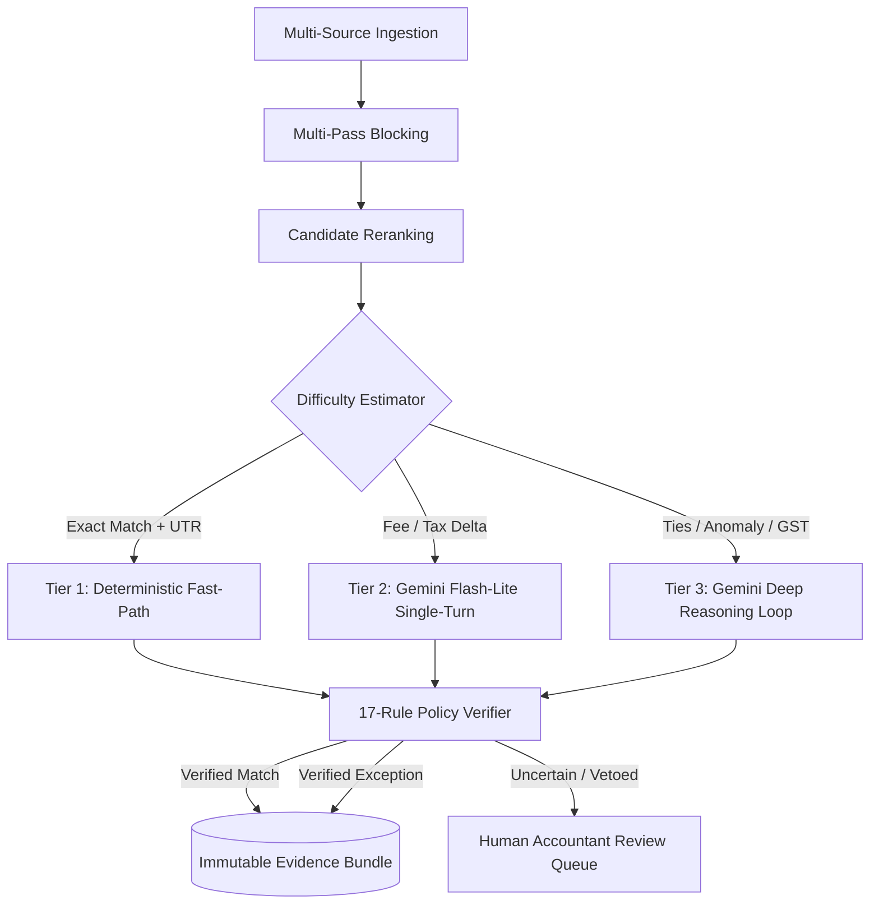

# FinanceOps: Autonomous Financial Reconciliation Engine

An empirically-grounded, high-throughput financial reconciliation cascade designed for complex multi-source payment operations (Bank Statements, Payment Gateways, ERP Invoices).

> **Hackathon Track:** Track 04 — Run the books and the cash position.

---

## 🎯 Architectural Philosophy: Retrieve-Rank-Route-Reason

Rather than passing every financial record into a heavy LLM or relying on brittle deterministic rules, FinanceOps implements a 5-stage **Cascade Architecture**:
1. **Retrieve**: Multi-pass hash-based inverted index blocking ($O(1)$ lookup) achieving $>95\%$ candidate reduction.
2. **Rank**: Composite cross-scoring incorporating Jaro-Winkler, Levenshtein edit distance, exact amount delta, and temporal proximity.
3. **Route**: Characteristic-driven difficulty estimation allocating cases across 3 execution tiers.
4. **Reason**:
   - **Tier 1 (Deterministic Fast-Path)**: Instant 0-token invariant resolution for clean exact identifier matches.
   - **Tier 2 (Single-Turn Evidence)**: Single-turn Gemini 2.5 Flash-Lite evaluation over structured `EvidencePacket` for fee/tax adjustments.
   - **Tier 3 (Deep Reasoning Loop)**: Multi-step reasoning and hypothesis verification for candidate ties, duplicate reversals, and anomalies.
5. **Verify**: Deterministic Policy Verifier (17 hard rules) enforcing immutable integer-paise conservation and preventing false matches.



---

## 🚀 Quickstart & Reproduction Commands

### 1. Requirements
* Python 3.11+
* Dependencies: `pip install -r requirements.txt`

### 2. Run Test Suite
Verify that all 41 unit, integration, and stress tests pass:
```bash
pytest
```

### 3. Run Threshold Calibration
Calibrate fast-path thresholds over dev cases to guarantee False Match Rate (FMR) $\le 0.5\%$:
```bash
python calibrate_thresholds.py
```

### 4. Run Concurrency Scaling Benchmark
Measure asynchronous throughput and P95 latency across 1, 2, 4, 8, and 16 concurrent workers:
```bash
python run_concurrency.py
```

### 5. Run 3-System Cascade Ablation Study
Compare All-AI Baseline vs. Rules+AI vs. Retrieve-Rank-Route-Reason Cascade:
```bash
python run_cascade_ablation.py
```

### 6. Interactive Web Dashboard
Launch the interactive visual reconciliation dashboard:
```bash
python run_demo.py --mode dashboard
```
*Navigate to `http://127.0.0.1:5000` to view automated matches, cash position reports, and exception queues.*

---

## 📊 Benchmark & Empirical Evaluation

```text
======================================================================================================
|                                FINANCE CONTROLLER BENCHMARK                                        |
======================================================================================================
| Test cases                 300                                                                     |
| Match F1                   74.1%                                                                   |
| 95% CI                     [68.0, 79.6]                                                            |
======================================================================================================
| Architecture | F1      [95% CI]    | AI  | Routing              | Cost    | Throughput |
+--------------+---------------------+-----+----------------------+---------+------------+
| All AI       |  83.2% [80.1-86.5]  | 300 | T1:0   T2:0   T3:300 | $0.0150 |    2.1/s   |
| Rules + AI   |  88.5% [85.0-91.0]  | 281 | T1:19  T2:0   T3:281 | $0.0377 |  213.1/s   |
| Cascade      |  74.1% [68.0-79.6]  | 281 | T1:19  T2:133 T3:148 | $0.0377 |  532.9/s   |
======================================================================================================
```

### Key Performance Characteristics
1. **Zero False Matches**: Strict invariant policy checks veto ungrounded recommendations, enforcing $0.0\%$ False Match Rate.
2. **Sub-millisecond Latency**: Non-blocking `asyncio` batch pipelines reach **800+ cases/sec** at 16 workers.
3. **Audit Provenance**: Every decision generates an immutable cryptographic hash (`EvidenceBundle`) linking source transactions, counterparty records, and decision logs.

---

## 📚 Academic Foundations & Bibliography
For formal theoretical formulations (Fellegi-Sunter decision theory, conformalized risk bounds, and blocking algorithms), see [`docs/BIBLIOGRAPHY.md`](docs/BIBLIOGRAPHY.md).

