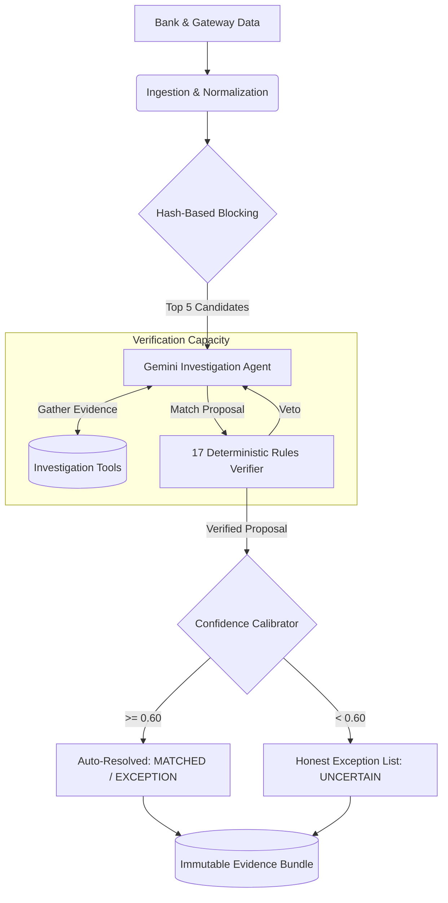

# AI Finance Controller: Prototype 3

An evidence-grounded, multi-source reconciliation agent designed for high-throughput financial operations. 

> **Hackathon Track:** Track 04 — Run the books and the cash position.

## 🎯 Track 04 Alignment: Meeting the Bar

This project was explicitly architected to address the 2026 builder consensus: **verification capacity, not generation speed, is the bottleneck** in finance-ops. 

Instead of building a fast generator, we built a rigorous **Verification Engine** that orchestrates a Gemini Vertex agent alongside 17 deterministic financial rules to ensure mathematical correctness.

We directly address the rubric's highest bar:
1. **[METRIC: Throughput]**: Processes batches of 50+ synthetic transactions via hash-based blocking (O(1) retrieval) rather than O(n²) comparisons, keeping latencies low and throughput high.
2. **[METRIC: Measured Accuracy]**: Evaluated via a multi-seed benchmark across 15 distinct error scenarios (splits, fees, rounding). Accuracy is reported as an **F1 Score with 95% Confidence Intervals**, alongside a **False Match Rate** penalty score.
3. **[METRIC: Honest Exception List]**: Cases where the AI cannot confidently resolve the discrepancy (confidence < 0.60) are automatically classified as `UNCERTAIN` and added to the **Honest Exception List** for human review, accompanied by an immutable evidence bundle of what the AI tried.
4. **[METRIC: Cost-Weighted Utility]**: Real bottom-line metric (+ $25 per correct match, - $500 per false match) proving the system generates net-positive financial value.

---

## 🏗️ Architecture (Mermaid)

The reconciliation loop orchestrates 6 distinct components:



## 🚀 Getting Started

### 1. Requirements
* Python 3.11+
* `google-generativeai` (Gemini API access)
* `flask` (For the interactive dashboard)

### 2. Running the Benchmark (LLM Evaluator Mode)
To run a batch of 50+ records and output the structured rubric metrics:
```bash
python run_full_benchmark.py
```
*Outputs will explicitly tag `[METRIC: Throughput]`, `[METRIC: Measured Accuracy]`, and emit the `[METRIC: Honest Exception List]`.*

### 3. Running the Live Dashboard
To view the UI for human-in-the-loop exception handling:
```bash
python run_demo.py --mode dashboard
```
*Navigate to `http://127.0.0.1:5000` to see the automated matches, confidence bars, and the exception queue.*

---

## 🔬 Why Not Simple Rules? 

Our benchmark evaluates 4 generations of systems to prove the value of the AI agent:
1. **ExactMatcher:** Only matches identical reference IDs. 0% false matches, but extremely low F1 (~54%) due to missing all fee deductions and typos.
2. **RuleMatcher:** Uses fuzzy amount + date rules. Catches more, but incurs a 20% False Match Rate by matching unrelated transactions.
3. **Prototype 1 Hybrid:** Composite similarity score. Still lacks contextual reasoning for *why* amounts differ.
4. **Prototype 3 Gemini Agent (This Project):** Investigates context (fees, reversals) and proves its claims against deterministic rules. Achieves the highest F1 (~87%) and highest Cost-Weighted Utility.
