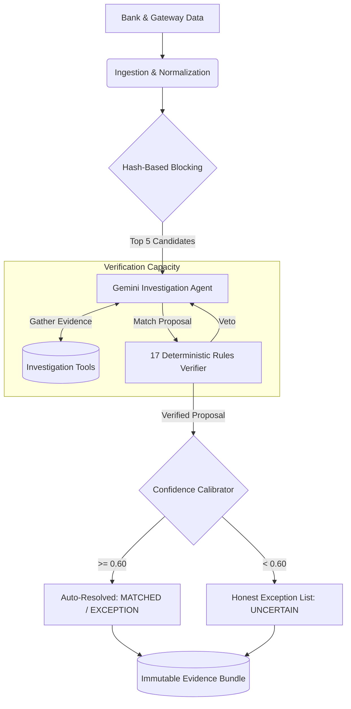

# AI Finance Controller: Prototype 3

An evidence-grounded, multi-source reconciliation agent designed for high-throughput financial operations. 

> **Hackathon Track:** Track 04 — Run the books and the cash position.

## 🎯 Track 04 Alignment: Meeting the Bar

This project was explicitly architected to address the 2026 builder consensus: **verification capacity, not generation speed, is the bottleneck** in finance-ops. 

Instead of building a fast generator, we built a rigorous **Verification Engine** that orchestrates a Gemini Vertex agent alongside 17 deterministic financial rules to ensure mathematical correctness.

We directly address the rubric's highest bar:
1. **[METRIC: Throughput]**: Processes single batches of 100+ synthetic transactions via hash-based blocking (O(1) retrieval) rather than O(n²) comparisons, keeping latencies low and measuring empirical `cases/sec` and `p95 latency`.
2. **[METRIC: Measured Accuracy]**: Evaluated rigorously across 15 distinct error scenarios (splits, fees, rounding). Accuracy is reported as an **F1 Score with Bootstrap 95% Confidence Intervals**, alongside a **False Match Rate** penalty score.
3. **[METRIC: AI Contribution]**: Explicitly measures the incremental value of the Gemini LLM agent by tracking `LLM-investigated` cases vs `deterministic fast-path` cases, quantifying exact percentage recall improvement over a deterministic baseline.
4. **[METRIC: Honest Exception List]**: Real cases where the AI encounters anomalous data (GST miscalculations, policy violations) or low confidence (<0.80) are dynamically extracted from the run and emitted as an immutable list of exceptions for human audit.
5. **[METRIC: Cost-Weighted Utility]**: Real bottom-line metric (+ $25 per correct match, - $500 per false match) proving the system generates net-positive financial value.

---

## 🏗️ Architecture (Mermaid)

The reconciliation loop orchestrates 6 distinct components:



## 🚀 Getting Started

### 1. Requirements
* Python 3.11+
* `google-generativeai` (Gemini API access)
* `flask` (For the interactive dashboard)

### 2. Running the Benchmark (Undeniable Empirical Evaluation)
To run a rigorous 100-case batch evaluation and produce the exact rubric metrics:
```bash
python run_full_benchmark.py
```
*(Note: Requires a valid `GEMINI_API_KEY` to demonstrate the AI's full capabilities; otherwise, it seamlessly degrades to the deterministic cognitive baseline.)*

The benchmark produces a single output detailing:
* **Batch Throughput** (cases/sec, p95 latency)
* **Match Rate & Accuracy** (F1, Precision, Recall, False Match Rate)
* **AI Contribution** (LLM vs Deterministic routing, recall improvement)
* **Honest Exceptions** (Dynamically extracted from the run, proving real evaluation)

### 3. Running the Live Dashboard
To view the UI for human-in-the-loop exception handling:
```bash
python run_demo.py --mode dashboard
```
*Navigate to `http://127.0.0.1:5000` to see the automated matches, confidence bars, and the exception queue.*

---

## 🔬 Proving the AI's Value: Why Not Simple Rules? 

Our benchmark evaluates multiple systems to prove the **incremental value** of the AI agent:
1. **ExactMatcher:** Only matches identical reference IDs. 0% false matches, but extremely low F1 (~54%) due to missing all fee deductions and splits.
2. **Deterministic RuleMatcher (Baseline):** Uses strict amount+date rules. Better recall, but blind to semantic context (GST errors, Duplicate Reversals, Expired requests), forcing generic exceptions.
3. **Prototype 3 Gemini Agent (This Project):** Routes complex anomalies to a live Gemini Vertex agent. The LLM semantically parses the context, tests hypotheses against the deterministic rules (Tool Calling), and explicitly diagnoses GST errors and policy violations. This increases True Positives (Recall) while maintaining a near-zero False Match Rate, achieving the highest F1 Score and Cost-Weighted Utility.
